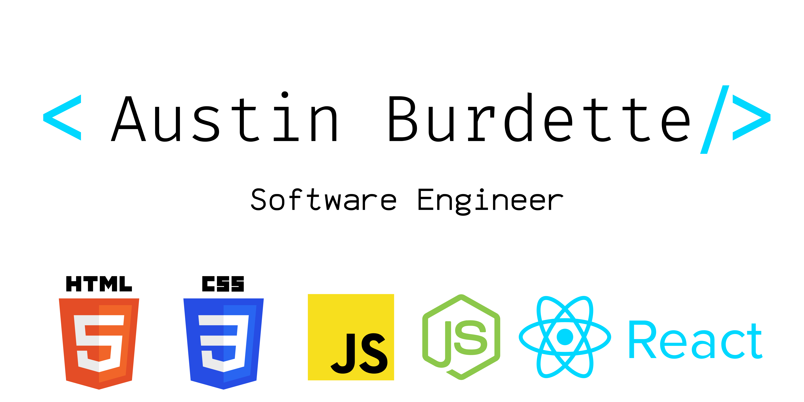

<h1>💫 About Me : </h1>
🔭 I’m currently building Tea Time.  
🌱 I’m currently learning React.js and Tailwind  
👯 I’m looking to collaborate on full stack web applications (especially those that are space/science involved).  
🤔 I’m looking for help with React.js  
💬 Ask me about Space or what books I'm reading.  
📫 How to reach me: Check social links below.  
⚡ Fun fact: I have lived in Maryland, Cambodia, Alaska, and Colorado.   

See [my website](https://austinburdette.vercel.app/) for more information! 

 

  
  
  
  
  

 

<h1 align="center">Projects</h1>
<table bordercolor="#66b2b2">
  
  <tr>
    <td width="50%" valign="top">
      <h3 align="center">NASA Picture of the Day</h3>
         
        
         
        
 A an app made for the Denver Astronomical Society. The app allows the user to view the NASA picture of the day as well as view previous posts from the repository. The application utilizes a NASA API.
        
    
  
      

        
<strong>

    </td>
    <td width="50%" valign="top">
      <h3 align="center">Book Club</h3>
         
      
         
        
 A full stack web application that allows the user to add the name of books and authors they've read for the year. The application sorts the books by rating and allows the user to delete and add books as necessary while keeping track of the total number of books read.
     
  
  
      

        
<strong>

    </td>
  </tr>
  
  <tr>
    <td width="50%" valign="top">
      <h3 align="center">Tea Time</h3>
       
        
       
        

  
  
      

        
<strong>

    </td>
    <td width="50%" valign="top">
      <h3 align="center">Workout Generator</h3>
         
        
         
        

          
  
  
      

        
<strong>

    </td>
  </tr>
</table>

<h1 align="center">Technologies</h1>

    
    
    
    
    
    
    
    
    
    
    
    
    
    
    
    
    
    
    
    

---

<h1 align="center">Connect</h1>

  
  
  
  
  

