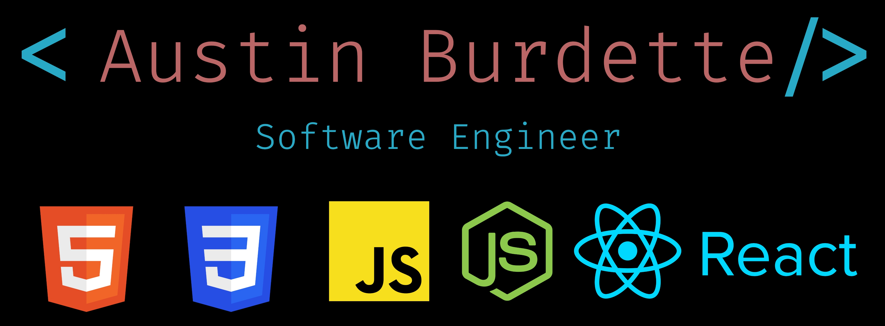
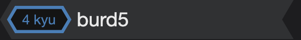

<h1>💫 About Me : </h1>
🔭 I’m currently building <a href="https://github.com/burd5/floridaman" target="_blank">Florida Man</a>  
🌱 I’m currently focusing on Python and MySQL 
👯 I’m looking to collaborate on full stack web applications and machine learning projects.  
💬 Ask me about Space or what books I'm reading.  
📫 How to reach me: Check social links below.  
⚡ Fun fact: I have lived in Maryland, Cambodia, Alaska, and Colorado.   

See <a href="https://austinburdette.vercel.app/" target="_blank">my website</a> for more information!

 

<h1 align="center">Connect</h1>

  
  
  
  

 

<h1 align="center">Projects</h1>
<table>
  
  <tr>
      <td width="50%" valign="top">
      <h3 align="center">Book Club</h3>
         
      
         
        
 A full stack web application that allows the user to add the name of books and authors they've read for the year. The application sorts the books by rating and allows the user to delete and add books as necessary while keeping track of the total number of books read.
     
  
  
      

        
<strong>

    </td>
        <td width="50%" valign="top">
      <h3 align="center">Tea Time</h3>
       
        
       
        
 This application allows tea amateurs and aficionados to find a new tea, either through the tea generator or by sorting through the tea collection. Users can create a profile to save their favorite teas.
        
  
  
      

        
<strong>

    </td>
  </tr>
  <tr>
    <td width="50%" valign="top">
      <h3 align="center">King of the Hill</h3>
       
        
       
        
 A full stack web application that allows user to keep track of the "king of the hill" based on their personal interests. The original app was created to keep track of movies, cafes, and diners. Users can add items to their list and see a ranking of where each spot stands. The current "king" is shown on the main page underneath each collection. 
      
      
  
  
      

        
<strong>

    </td>
        <td width="50%" valign="top">
      <h3 align="center">Future U Dashboard</h3>
         
        
         
        
 This React application keeps track of key metrics for the Future U Young Adult Team at A/D Works! Team members can view team or personal statistics, which include graphs, trends, and team rank. 
          
          
  
  
      

        
<strong>

    </td>
  </tr>
  <tr>
        <td width="50%" valign="top">
      <h3 align="center">NASA Picture of the Day</h3>
         
        
         
        
 A an app made for the Denver Astronomical Society. The app allows the user to view the NASA picture of the day as well as view previous posts from the repository. The application utilizes a NASA API.
        
    
  
      

        
<strong>

    </td>
        <td width="50%" valign="top">
      <h3 align="center">Burd's Brown Egg</h3>
         
        
         
        
 Burd's Brown Egg is a React web application for the game Burd's Brown Egg. The game is part myth, part joke, but an actual thing. The website allows user to learn about the game, it's history, the rules, etc.   
          
  
  
      

        
<strong>

    </td>
  </tr>
</table>

<h1 align="center">Technologies</h1>

  
  
  
  
  
  
  
  
  
  
  
  
   

<h2>Code Wars Rank</h2>

---
